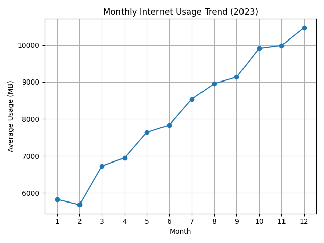
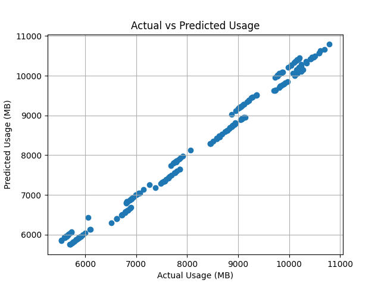
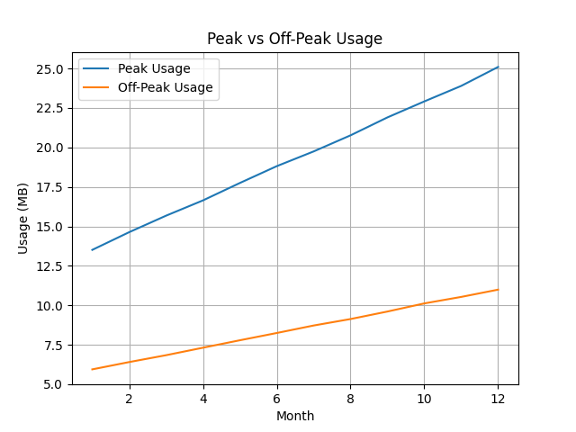

# PySpark Internet Usage Analysis

## Project Overview
This project analyzes internet usage data using PySpark and predicts monthly data consumption using a Machine Learning model.

---

## Objectives
- Analyze user internet behavior  
- Identify peak and off-peak usage patterns  
- Predict monthly internet data usage  

---

## Technologies Used
- Python  
- PySpark  
- Machine Learning (Linear Regression)  
- Matplotlib  

---

## Dataset
- Simulated dataset with hourly internet usage  
- Aggregated into monthly data  

---

## Features Used
- Average hourly usage  
- Peak hour usage  
- Off-peak usage  
- Previous month usage  

---

## Model Performance
- MAE: ~135  
- RMSE: ~163  
- R² Score: ~0.98  

---

## Visualizations

### Monthly Internet Usage Trend

This graph shows how internet usage increases over months.

---

### Actual vs Predicted Usage

This graph compares actual vs predicted values, showing high model accuracy.

---

### Peak vs Off-Peak Usage

This graph shows differences between peak and off-peak internet usage.

---

## How to Run

1. Install dependencies:
   pip install -r requirements.txt  
2. Run the project:
   python main.py
   
---

## 💡 Key Insights
- Internet usage increases steadily over time  
- Peak usage is consistently higher than off-peak  
- Model predicts usage with high accuracy  

---

## 👨‍💻 Author
Faizan Ahmed
